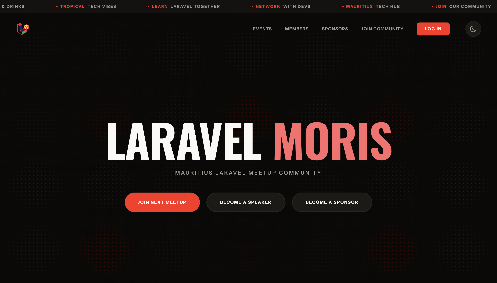

<div align="center">

# Laravel Moris



The official website for the Mauritius Laravel Meetup Community. Built with Laravel 12 and Tailwind CSS.

[](https://laravel.com)
[](https://php.net)
[](https://tailwindcss.com)

</div>

## About

Laravel Moris is a community website for the Mauritius Laravel Meetup group. It helps members:

- **Discover events** - Upcoming and past meetups with speakers and sponsors
- **RSVP to meetups** - Track attendance with Going/Maybe/Not Going options
- **Submit talks** - Call for papers with speaker information
- **Connect with members** - Browse the community member directory
- **Meet sponsors** - View sponsor logos and event history

## Tech Stack

- **Framework**: Laravel 12 (PHP 8.4)
- **Styling**: Tailwind CSS v4
- **Database**: SQLite (development) / MySQL (production)
- **Testing**: Pest 4
- **Authentication**: Laravel Socialite (GitHub, Google OAuth)
- **Package Manager**: Composer

## Features

### Community Management

- Member profiles with avatar, title, and bio
- Speaking history and attendance tracking
- Event-based RSVP system with status tracking

### Event System

- Upcoming and past event listings
- Event details with speakers, sponsors, and attendees
- RSVP functionality for authenticated users
- Paper submission for speaking opportunities

### Sponsor Recognition

- Sponsor directory with event counts
- Individual sponsor profiles with history
- Logo management with fallback support

## Getting Started

### Prerequisites

- PHP 8.4+
- Composer
- Node.js & npm
- Laravel Herd (recommended)

> [!NOTE]
> **Development Environment Options**
>
> **New to PHP? Start here:**
>
> **Option 1: php.new (Windows, Mac, Linux)**
>
> - One-line command to install PHP 8.5, Composer, and Laravel
> - Fast setup for complete beginners
> - [Visit php.new](https://php.new/)
> - After installation, use Compose for database/email (see below)
>
> **Option 2: Laravel Herd (macOS/Windows) - Free/Paid**
>
> - All-in-one
> - Includes PHP, Nginx, databases*, and mail interface*
> - Free tier works great, use `compose.yaml` or DBngin (MacOS) for MySQL as complementary
> - [Download Herd](https://herd.laravel.com/)
>
> **Know PHP but new to Laravel?**
>
> **Option 3: Compose**
>
> - Use your existing PHP installation
> - Provides MySQL 8.5 and Mailpit for email testing (TODO)
> - Run: `docker compose up -d` (TODO)
>
> **Experienced Laravel Developer?**
>
> **Option 4: Laravel Valet (macOS)**
>
> - Free CLI alternative to Herd
> - [Valet Documentation](https://laravel.com/docs/12.x/valet)
>
> **Option 5: Valet+ (Linux)**
>
> - Valet for Ubuntu/Debian users
> - Same lightweight approach as Valet with MYSQL included
> - [Valet+ Documentation](https://valetlinux.plus)

### Installation

1. **Fork & Clone the repository**

    ```bash
    git clone https://github.com/yourusername/laravelmoris.com.git
    cd laravelmoris.com
    ```

2. **Install PHP dependencies**

    ```bash
    composer install
    ```

3. **Install frontend dependencies**

    ```bash
    npm install
    ```

4. **Configure environment**

    ```bash
    cp .env.example .env
    php artisan key:generate
    ```

5. **Setup database**

    ```bash
    php artisan migrate
    php artisan db:seed --class=HomepageSeeder
    ```

6. **Build assets**

    ```bash
    npm run dev
    ```

7. **Start the development server**

    ```bash
    php artisan serve
    ```

    Or with Laravel Herd, the site is automatically available at `https://laravelmoris.com.test`

### Testing

```bash
# Run all tests
php artisan test

# Run with coverage
herd coverage ./vendor/bin/pest --coverage
```

### Code Quality

```bash
# Format code
vendor/bin/pint --dirty

# Static analysis
vendor/bin/phpstan analyse

# Everything at once
composer lint:fix
```

## Project Structure

```
app/
├── Actions/          # Business logic (Actions-first architecture)
│   ├── Auth/
│   ├── Event/
│   ├── Paper/
│   └── Profile/
├── Controllers/      # HTTP handlers
├── Data/            # Spatie Laravel Data DTOs
├── Enums/           # PHP enums
├── Http/
│   ├── Controllers/
│   └── Requests/
├── Models/          # Eloquent models
├── Queries/         # Data fetching queries
└── Providers/
```

## Routes

| Path                        | Description                               |
| --------------------------- | ----------------------------------------- |
| `/`                         | Home page with upcoming events            |
| `/events`                   | All events (upcoming & past)              |
| `/events/{id}`              | Event details with RSVP                   |
| `/members`                  | Community member directory                |
| `/members/{id}`             | Member profile                            |
| `/sponsors`                 | Sponsor directory                         |
| `/sponsors/{id}`            | Sponsor profile                           |
| `/join`                     | Community links (Discord, WhatsApp, etc.) |
| `/profile`                  | User profile (auth required)              |
| `/events/{id}/submit-paper` | Talk submission (auth required)           |

## API

Laravel Moris exposes a RESTful API for programmatic access to meetup data.

### Endpoints

| Method | Endpoint               | Description           |
| ------ | ---------------------- | --------------------- |
| `GET`  | `/api/meetups`         | List all meetups      |
| `GET`  | `/api/meetups/{event}` | Get a specific meetup |


## Database Schema

### Core Tables

- `users` - Community members
- `events` - Meetup events
- `papers` - Talk submissions
- `sponsors` - Event sponsors
- `community_links` - Discord, WhatsApp, etc.

### Pivot Tables

- `event_user` - User RSVPs with status (going/maybe/not_going)
- `event_sponsor` - Event sponsorships
- `papers` - Links users to events as speakers

## Contributing

This is a community project. If you'd like to contribute:

1. Fork the repository
2. Create a feature branch
3. Make your changes
4. Run tests and code quality tools
5. Submit a pull request

## License

MIT License - feel free to use this as a reference for your own Laravel projects.

---

Built with ❤️ for the Mauritius Laravel Community
